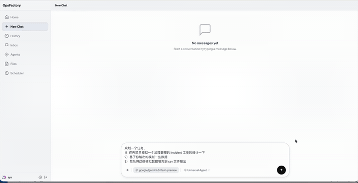
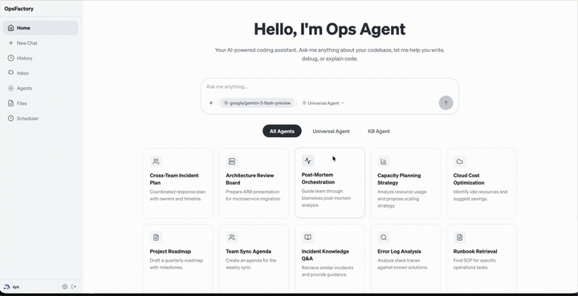
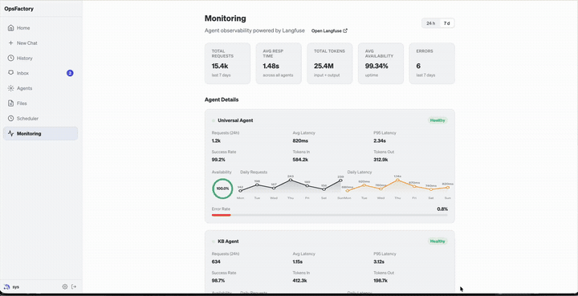
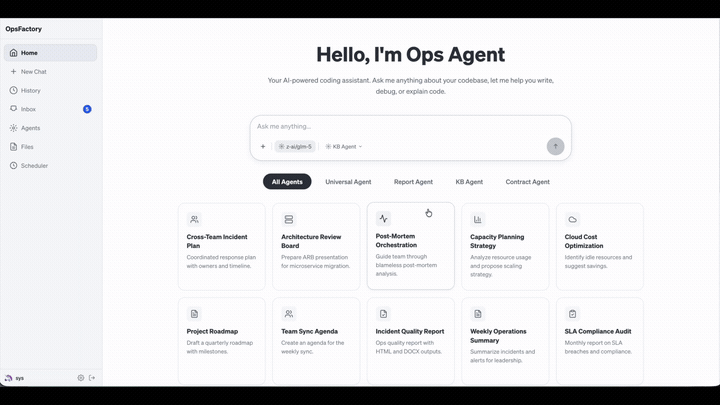

# Ops Factory

A multi-tenant AI agent management platform built on [Goose](https://github.com/block/goose). Ops Factory provides a unified web interface for managing multiple AI agents that collaborate on operations tasks such as incident analysis, knowledge retrieval, and report generation.

## Demo Videos

### 1. Universal Agent Planning



### 2. Visualization & Chart


### 3. Artifacts Preview



### 4. Scheduler


### 5. Monitoring & Observation



### 6. KB Agent (Feishu)



### 7. Self-Supervisor Agent


## Architecture

```text
Web App (React/Vite :5173)
    |
    |  x-secret-key / x-user-id
    v
Gateway (Node.js :3000)
    |
    +-- InstanceManager: spawns goosed processes per user on dynamic ports
    |     +-- "admin" instances (always running, handles schedules)
    |     +-- per-user instances (spawned on demand, idle-reaped after 15 min)
    |
    +-- Routes: /agents/:id/agent/* -> proxy to user's goosed instance
    +-- Routes: /agents/:id/sessions/* -> session management
    +-- Routes: /agents/:id/files/* -> file serving
    +-- Routes: /agents/:id/config -> agent config CRUD
```

See [docs/architecture/overview.md](./docs/architecture/overview.md) for the architecture overview and [docs/README.md](./docs/README.md) for the full documentation map.

## Documentation

Use these documents as the main entry points for collaboration:

- [AGENTS.md](./AGENTS.md): short contributor rules and cross-team constraints
- [docs/README.md](./docs/README.md): documentation map
- [docs/architecture/overview.md](./docs/architecture/overview.md): system boundaries and module responsibilities
- [docs/development/review-checklist.md](./docs/development/review-checklist.md): pull request and review checklist

## Components

| Component | Directory | Port | Description |
|-----------|-----------|------|-------------|
| Gateway | `gateway/` | 3000 | Node.js HTTP server managing per-user agent instances, proxying, and routing |
| Web App | `web-app/` | 5173 | React frontend for chat, session management, file browsing, and agent configuration |
| TypeScript SDK | `typescript-sdk/` | — | Client library (`@goosed/sdk`) for programmatic access to the Goose API |
| Agents | `agents/` | — | Pre-configured AI agents (universal, kb, report) with YAML configs and skills |
| Prometheus Exporter | `prometheus-exporter/` | 9091 | Spring Boot exporter exposing gateway monitoring metrics for Prometheus |
| Prometheus Exporter (Legacy) | `prometheus-exporter-legacy/` | 9091 | Legacy Node.js/TypeScript exporter kept for rollback reference |
| Langfuse | `langfuse/` | 3100 | LLM observability platform (Docker Compose) |
| OnlyOffice | — | 8080 | Office document preview server (Docker) |

## Quick Start

### Prerequisites

- Node.js 18+
- [goosed](https://github.com/block/goose) binary installed and on PATH
- Docker (for OnlyOffice and Langfuse)

### Start All Services

```bash
./scripts/ctl.sh startup
```

This starts OnlyOffice, Langfuse, Gateway, and Web App in order. The web app is available at `http://127.0.0.1:5173`.

### Start Individual Components

```bash
./scripts/ctl.sh startup gateway    # Start gateway only
./scripts/ctl.sh startup webapp     # Start web app only
./scripts/ctl.sh shutdown all       # Stop all services
./scripts/ctl.sh status             # Check service status
./scripts/ctl.sh restart gateway    # Restart gateway
```

### Manual Setup

```bash
# 1. Gateway
cd gateway && npm install && npm run dev

# 2. Web App (in another terminal)
cd web-app && npm install && npm run dev

# 3. Open http://127.0.0.1:5173
```

## TypeScript SDK

```bash
cd typescript-sdk && npm install && npm run build
```

```typescript
import { GoosedClient } from '@goosed/sdk';

const client = new GoosedClient({
  baseUrl: 'http://127.0.0.1:3000/agents/universal-agent',
  secretKey: 'test',
  userId: 'alice',
});

// Start a session and chat
const session = await client.startSession('/path/to/workdir');
const reply = await client.chat(session.id, 'Hello!');
console.log(reply);

// Streaming
for await (const event of client.sendMessage(session.id, 'Explain this code')) {
  if (event.type === 'Message') {
    console.log(event.message);
  }
}
```

## Testing

```bash
cd test
npm install
npm test                  # Vitest integration tests
npm run test:e2e          # Playwright E2E tests (requires running app)
npm run test:e2e:headed   # E2E with visible browser
```

## Configuration

Every component uses a unified configuration approach:

```text
config.yaml  →  environment variable override  →  error if required field missing
```

Each component has its own `config.yaml` in its directory. Copy the corresponding `config.yaml.example` to `config.yaml` and edit as needed. Environment variables always take priority over `config.yaml` values.

### Gateway (`gateway/config.yaml`)

| Field | Env Var | Default | Required |
| ----- | ------- | ------- | -------- |
| `server.host` | `GATEWAY_HOST` | `0.0.0.0` | |
| `server.port` | `GATEWAY_PORT` | `3000` | |
| `server.secretKey` | `GATEWAY_SECRET_KEY` | — | **Yes** |
| `server.corsOrigin` | `CORS_ORIGIN` | `*` | |
| `tls.cert` | `TLS_CERT` | — | |
| `tls.key` | `TLS_KEY` | — | |
| `paths.projectRoot` | `PROJECT_ROOT` | auto-detected | |
| `paths.agentsDir` | `AGENTS_DIR` | `<projectRoot>/gateway/agents` | |
| `paths.usersDir` | `USERS_DIR` | `<projectRoot>/gateway/users` | |
| `paths.goosedBin` | `GOOSED_BIN` | `goosed` | |
| `idle.timeoutMinutes` | `IDLE_TIMEOUT_MS` (ms) | `15` | |
| `idle.checkIntervalMs` | `IDLE_CHECK_INTERVAL_MS` | `60000` | |
| `upload.maxFileSizeMb` | `MAX_UPLOAD_FILE_SIZE_MB` | `10` | |
| `upload.maxImageSizeMb` | `MAX_UPLOAD_IMAGE_SIZE_MB` | `5` | |
| `upload.retentionHours` | `UPLOAD_RETENTION_HOURS` | `24` | |
| `officePreview.enabled` | `OFFICE_PREVIEW_ENABLED` | `false` | |
| `officePreview.onlyofficeUrl` | `ONLYOFFICE_URL` | `http://localhost:8080` | |
| `officePreview.fileBaseUrl` | `ONLYOFFICE_FILE_BASE_URL` | `http://host.docker.internal:3000` | |
| `vision.mode` | `VISION_MODE` | `passthrough` | |
| `langfuse.host` | `LANGFUSE_HOST` | — | |
| `langfuse.publicKey` | `LANGFUSE_PUBLIC_KEY` | — | |
| `langfuse.secretKey` | `LANGFUSE_SECRET_KEY` | — | |

Agent-specific configuration (LLM provider, model, extensions) remains in `gateway/agents/{id}/config/config.yaml`.

### Web App (`web-app/config.yaml`)

| Field | Env Var | Default | Required |
| ----- | ------- | ------- | -------- |
| `gatewayUrl` | `GATEWAY_URL` | — | **Yes** |
| `gatewaySecretKey` | `GATEWAY_SECRET_KEY` | — | **Yes** |
| `knowledgeServiceUrl` | `KNOWLEDGE_SERVICE_URL` | `http://127.0.0.1:8092` | |
| `port` | `VITE_PORT` | `5173` | |

### Prometheus Exporter (`prometheus-exporter/config.yaml`)

| Field | Env Var | Default | Required |
| ----- | ------- | ------- | -------- |
| `port` | `EXPORTER_PORT` | `9091` | |
| `gatewayUrl` | `GATEWAY_URL` | — | **Yes** |
| `gatewaySecretKey` | `GATEWAY_SECRET_KEY` | — | **Yes** |
| `collectTimeoutMs` | `COLLECT_TIMEOUT_MS` | `5000` | |

> Legacy implementation has been moved to `prometheus-exporter-legacy/`.

### Langfuse (`langfuse/config.yaml`)

All fields are optional with defaults for local development. The `ctl.sh` script reads `config.yaml` and generates a `.env` file consumed by Docker Compose.

| Field | Env Var | Default |
| ----- | ------- | ------- |
| `port` | `LANGFUSE_PORT` | `3100` |
| `postgres.db` | `POSTGRES_DB` | `langfuse` |
| `postgres.user` | `POSTGRES_USER` | `langfuse` |
| `postgres.password` | `POSTGRES_PASSWORD` | `langfuse` |
| `postgres.port` | `POSTGRES_PORT` | `5432` |
| `nextauthSecret` | `NEXTAUTH_SECRET` | — |
| `salt` | `SALT` | — |
| `telemetryEnabled` | `TELEMETRY_ENABLED` | `false` |
| `init.*` | `LANGFUSE_INIT_*` | see `config.yaml.example` |

### OnlyOffice (`onlyoffice/config.yaml`)

All fields are optional. The `ctl.sh` script reads `config.yaml` and generates a `.env` file consumed by Docker Compose.

| Field | Env Var | Default |
| ----- | ------- | ------- |
| `port` | `ONLYOFFICE_PORT` | `8080` |
| `jwtEnabled` | `JWT_ENABLED` | `false` |
| `pluginsEnabled` | `PLUGINS_ENABLED` | `false` |
| `allowPrivateIpAddress` | `ALLOW_PRIVATE_IP_ADDRESS` | `true` |
| `allowMetaIpAddress` | `ALLOW_META_IP_ADDRESS` | `true` |

## Project Structure

```text
ops-factory/
├── gateway/           # Node.js HTTP gateway
├── web-app/           # React frontend
├── typescript-sdk/    # @goosed/sdk client library
├── agents/            # Agent configurations (YAML + skills)
├── langfuse/          # Langfuse Docker Compose
├── prometheus-exporter/ # Spring Boot Prometheus exporter
├── prometheus-exporter-legacy/ # Legacy Node.js exporter
├── scripts/           # Service management (ctl.sh)
├── test/              # Integration and E2E tests
├── docs/              # Architecture documentation
└── users/             # Per-user runtime directories (auto-generated)
```
