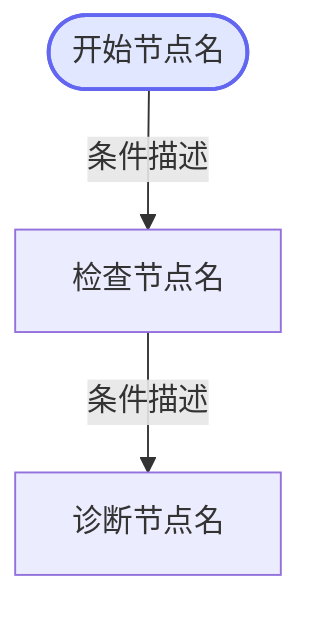

# SOP 环境实时诊断

## 概述
根据故障根因匹配预定义的 SOP 流程，自动在目标主机上执行诊断命令，收集并分析结果，生成环境实时诊断报告。

## Gateway API 调用约定

所有 curl 调用遵循以下约定（PowerShell 中执行）：
- **使用 `curl.exe`**（而非 `curl`，避免 PowerShell Invoke-WebRequest 别名导致的编码和格式问题）
- **设置 UTF-8 编码**：每次 curl 前先执行 `[Console]::OutputEncoding = [System.Text.Encoding]::UTF8`
- **公共请求头**：`-H "x-secret-key: test" -H "x-user-id: admin"`
- **环境变量**：`$env:GATEWAY_URL`（已由系统注入，默认 `http://127.0.0.1:3000`）
- **每条命令前加 `Write-Host`** 输出描述性标题，便于区分不同操作

## 执行流程

### 步骤1：匹配SOP
根据当前故障根因分析的结果，执行以下 curl 命令获取可用SOP列表：
```powershell
Write-Host "=== 获取SOP列表 ===" ; [Console]::OutputEncoding = [System.Text.Encoding]::UTF8; curl.exe -s -H "x-secret-key: test" -H "x-user-id: admin" "$env:GATEWAY_URL/gateway/sops"
```
根据返回结果中各 SOP 的 `triggerCondition` 字段匹配最适合的SOP，记录 `sopId`。
如无匹配SOP，告知用户当前无对应SOP，结束流程。

### 步骤2：获取SOP详情并生成流程图
使用匹配到的 sopId 执行以下 curl 命令获取完整SOP流程定义：
```powershell
Write-Host "=== 获取SOP详情 ===" ; [Console]::OutputEncoding = [System.Text.Encoding]::UTF8; curl.exe -s -H "x-secret-key: test" -H "x-user-id: admin" "$env:GATEWAY_URL/gateway/sops/{sopId}"
```

获取 SOP 详情后，**必须根据返回的 nodes 数组生成 mermaid 流程图**，展示给用户：



mermaid 生成规则：
- **start 类型节点**：用 `(["名称"])` 圆角矩形，并添加 indigo 样式 `style N0 fill:#e0e7ff,stroke:#6366f1,stroke-width:2px`
- **其他节点**：用 `["名称"]` 矩形
- **边（连线）**：从 transitions 数组生成，格式 `N{srcIndex} -->|"条件文本"| N{dstIndex}`
- **nextNodes**：如果 nextNodes 数组有多个目标，每个目标生成一条边
- **nextNodeId**：存储的是目标节点的 name，需通过 name 查找对应节点索引

### 步骤3：按SOP流程逐步执行
从 type=start 的节点开始，对每个节点执行以下操作：

#### 对每个SOP节点：

1. **获取目标主机**：执行以下 curl 命令获取匹配标签的目标主机列表（将 tags 数组以逗号拼接）：
```powershell
Write-Host "=== 查询目标主机: tags={tags} ===" ; [Console]::OutputEncoding = [System.Text.Encoding]::UTF8; curl.exe -s -H "x-secret-key: test" -H "x-user-id: admin" "$env:GATEWAY_URL/gateway/hosts?tags=tag1,tag2"
```

2. **构造命令（泛化机制）**：
   - 读取节点的 `command` 模板和 `commandVariables` 定义
   - **优先使用上下文推断**：根据当前诊断上下文（根因分析结果、环境信息等）推断变量值
   - **其次使用默认值**：对无法推断的变量使用 `commandVariables` 中的 `defaultValue`
   - **允许自主调整**：可根据实际情况适当调整命令参数（如增大 tail 行数、修改过滤条件），但**命令主体必须在白名单内**
   - 替换 `{{变量名}}` 占位符，生成最终命令

3. **执行远程命令并保存附件**：对每台匹配主机执行以下命令。**curl 结果必须同时保存为附件文件**，以便用户下载查看原始输出：
```powershell
Write-Host "=== 执行远程命令: {hostName} ===" ; [Console]::OutputEncoding = [System.Text.Encoding]::UTF8; New-Item -ItemType Directory -Force -Path "./output" | Out-Null; $r = curl.exe -s -X POST -H "Content-Type: application/json" -H "x-secret-key: test" -H "x-user-id: admin" -d '{\"hostId\":\"{hostId}\",\"command\":\"{command}\",\"timeout\":30}' "$env:GATEWAY_URL/gateway/remote/execute"; [System.IO.File]::WriteAllText("$PWD/output/sop-exec-{hostName}-{timestamp}.log", $r, [System.Text.Encoding]::UTF8); $r
```

**附件保存要求**：
- 每次远程命令执行的结果必须保存到 `./output/` 目录
- 文件名格式：`sop-exec-{主机名}-{yyyyMMddHHmmss}.log`
- 使用 `[System.IO.File]::WriteAllText` 以 UTF-8 编码保存，避免中文乱码
- 系统会自动检测 output 目录中的新文件并生成可下载的附件
- 你无需在回复中重复粘贴完整原始输出，但需要在分析中引用关键信息

4. **收集输出**：汇总所有主机的命令执行结果
   - 原始输出已通过附件文件保存，用户可在聊天中直接下载查看
   - 你需要在分析中引用命令输出中的关键信息

5. **分析输出**：根据节点的 `analysisInstruction` 和 `outputFormat` 分析命令输出
   - 可结合上下文中已有的诊断信息进行综合分析

6. **分支判断**：根据分析结果和节点的 `transitions` 条件，决定下一个执行节点
   - 如果 `transitions` 中有多个 nextNodes 匹配，这些节点应依次执行
   - 可根据实际情况**跳过不必要的节点**或**补充额外检查**（体现泛化能力）

### 步骤4：生成诊断报告
将所有节点的执行结果和分析汇总，按模板生成环境实时诊断报告。

## 输出报告格式
报告保存为: `./output/sop-diagnosis-report-{yyyyMMddHHmmss}.md`

报告结构：
```markdown
# SOP环境实时诊断报告

## 诊断概述
- **SOP名称**：{sopName}
- **触发原因**：{triggerReason}
- **诊断时间**：{timestamp}
- **涉及主机**：{hostList}

## SOP执行流程图
（此处展示步骤2中生成的 mermaid 流程图）

## 节点执行结果

### 节点1：{nodeName}
- **目标主机**：{hostName} ({ip})
- **执行命令**：`{command}`
- **命令输出**：
  ```
  {output}
  ```
- **分析结论**：{analysis}

### 节点2：{nodeName}
...

## 综合分析
{overallAnalysis}

## 处理建议
{suggestions}
```

## 安全约束
- 所有执行的命令必须在命令白名单内，白名单外的命令将被系统拒绝
- 只执行只读类诊断命令（ps, tail, grep, cat, ls, df, free, netstat, top等）
- 不执行任何修改类命令（rm, mv, chmod, reboot, service等）

## 异常处理
- 主机连接失败：记录失败信息，继续执行其他主机
- 命令执行超时：标记超时，继续执行其他节点
- 命令被白名单拒绝：记录拒绝原因，尝试使用替代命令
- SOP匹配失败：告知用户，建议手动排查
