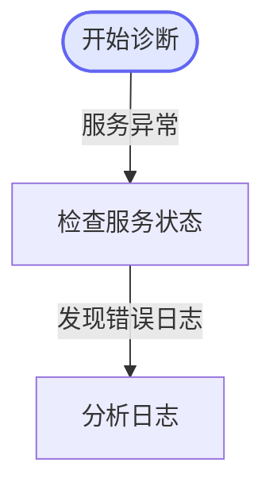

# SOP 环境实时诊断

## 概述
根据故障根因匹配预定义的 SOP 流程，自动在目标主机上执行诊断命令，收集并分析结果，生成环境实时诊断报告。

## 执行流程

### 调用方式（Node 命令）
本技能接在本地执行 `node` 命令调用 `sop-executor` 的 handlers。

执行前先进入目录：
```bash
cd qos-agent/config/mcp/sop-executor
```

按需设置环境变量（不设置则使用默认值）：
```bash
export GATEWAY_URL="http://127.0.0.1:3000"
export GATEWAY_SECRET_KEY="test"
export OUTPUT_DIR="./output"
```

### 步骤1：匹配SOP
根据当前故障根因分析的结果，执行以下命令获取可用SOP列表：
```bash
node --input-type=module -e "import { dispatch } from './dist/handlers.js'; console.log(await dispatch('list_sops', {}))"
```
根据返回结果中各 SOP 的 `triggerCondition` 字段匹配最适合的SOP，记录 `sopId`。
如无匹配SOP，告知用户当前无对应SOP，结束流程。

### 步骤2：获取SOP详情并生成流程图
使用匹配到的 sopId 执行以下命令获取完整SOP流程定义：
```bash
SOP_ID="<sopId>" node --input-type=module -e "import { dispatch } from './dist/handlers.js'; const r = await dispatch('get_sop_detail', { sopId: process.env.SOP_ID }); console.log(Array.isArray(r) ? r[0].text : r)"
```

获取 SOP 详情后，**必须根据返回的 nodes 数组生成 mermaid 流程图**，展示给用户：



mermaid 生成规则：
- **节点声明**：先声明所有节点，再声明所有边，最后声明样式
- **start 类型节点**：用 `N{i}(["名称"])` 圆角矩形，并在最后添加 `style N{i} fill:#e0e7ff,stroke:#6366f1,stroke-width:2px`
- **browser 类型节点**：用 `N{i}{{"名称"}}` 六边形，并在最后添加 `style N{i} fill:#fef3c7,stroke:#f59e0b,stroke-width:2px`
- **其他节点**：用 `N{i}["名称"]` 矩形
- **节点索引映射**：按 nodes 数组顺序，第一个节点为 N0，第二个为 N1，以此类推
- **边（连线）**：从 transitions 数组生成，格式 `N{srcIndex} -->|"条件文本"| N{dstIndex}`
- **nextNodes**：存储的是目标节点的 **name**（不是 index），需通过 name 查找该节点在数组中的索引作为 dstIndex
- **文本净化（关键！）****：节点名称和条件文本中，必须替换以下 mermaid 特殊字符：
  - `"` → `'`（双引号变单引号）
  - `(` `)` `[` `]` `{` `}` `<` `>` → 删除或替换为空格
  - `|` → `-`
  - 确保标签和条件文本中**不包含**上述特殊字符


### 步骤3：按SOP流程逐步执行
从 type=start 的节点开始，对每个节点执行以下操作：

#### 当节点 type=browser 时的执行流程

浏览器节点使用 `browser-use` MCP 工具（基于 Puppeteer 控制 Chromium）在本地执行操作（不需要远程主机）：

1. **打开目标 URL**：调用 `browser_navigate` 工具，传入 `node.browserUrl`，返回页面标题和可交互元素列表（带索引号）
2. **执行操作**：根据 `node.browserAction` 中的自然语言描述，逐步调用浏览器工具完成操作：
   - 先分析描述中包含的操作意图（点击、输入、选择、滚动等）
   - 使用 `browser_navigate` 返回的元素索引定位目标元素
   - 点击元素：`browser_click`（传入元素索引）
   - 输入文本：`browser_type`（传入元素索引 + 文本内容 + 是否按 Enter）
   - 滚动页面：`browser_scroll`（up 或 down）
   - 每步操作后可调用 `browser_get_state` 验证页面状态
3. **提取页面数据**：调用 `browser_extract` 提取页面文本内容（传 "all" 获取全文，或传 CSS 选择器获取特定区域），结合 `outputFormat` 要求获取所需信息
4. **截图记录**：调用 `browser_screenshot` 保存截图到 output 目录
5. **关闭浏览器**：操作完成后调用 `browser_close` 关闭会话
6. **分析输出**：根据 `analysisInstruction` 分析浏览器操作结果
7. **分支判断**：与其他节点类型相同

#### 对每个SOP节点（type=start 或 analysis）：

1. **获取目标主机**：执行以下命令获取匹配标签的目标主机列表（将 tags 数组以逗号拼接）：
```bash
TAGS="<tags>" node --input-type=module -e "import { dispatch } from './dist/handlers.js'; const tags = (process.env.TAGS || '').split(',').map(s => s.trim()).filter(Boolean); console.log(await dispatch('get_hosts', { tags }))"
```

2. **构造命令（泛化机制）**：
   - 读取节点的 `command` 模板和 `commandVariables` 定义
   - **优先使用上下文推断**：根据当前诊断上下文（根因分析结果、环境信息等）推断变量值
   - **其次使用默认值**：对无法推断的变量使用 `commandVariables` 中的 `defaultValue`
   - **允许自主调整**：可根据实际情况适当调整命令参数（如增大 tail 行数、修改过滤条件），但**命令主体必须在白名单内**
   - 替换 `{{变量名}}` 占位符，生成最终命令

3. **执行命令**：对每台匹配主机执行以下命令
```bash
HOST_ID="<hostId>" CMD="<command>" TIMEOUT="30" node --input-type=module -e "import { dispatch } from './dist/handlers.js'; console.log(await dispatch('execute_remote_command', { hostId: process.env.HOST_ID, command: process.env.CMD, timeout: process.env.TIMEOUT ? Number(process.env.TIMEOUT) : undefined }))"
```

**附件保存要求**：
- 每次远程命令执行的结果必须保存到 `./output/` 目录
- 文件名格式：`sop-exec-{主机名}-{yyyyMMddHHmmss}.log`
- 使用 `UTF8Encoding($false)` 保存，**不带 BOM**，避免中文乱码
- 系统会自动检测 output 目录中的新文件并生成可下载的附件
- 你无需在回复中重复粘贴完整原始输出，但需要在分析中引用关键信息

4. **收集输出**：汇总所有主机的命令执行结果
   - 每次调用 `execute_remote_command` 的原始输出会自动保存为附件文件，用户可在聊天中直接下载查看
   - 你无需手动保存每条命令的原始输出，但需要在分析中引用关键信息

5. **分析输出**：根据节点的 `analysisInstruction` 和 `outputFormat` 分析命令输出
   - 可结合上下文中已有的诊断信息进行综合分析

6. **分支判断**：根据分析结果和节点的 `transitions` 条件，决定下一个执行节点
   - 如果 `transitions` 中有多个 nextNodes 匹配，这些节点应依次执行
   - 可根据实际情况**跳过不必要的节点**或**补充额外检查**（体现泛化能力）

### 步骤4：生成诊断报告
将所有节点的执行结果和分析汇总，按模板生成环境实时诊断报告。

## 输出报告格式
报告保存为: `./output/sop-diagnosis-report-{yyyyMMddHHmmss}.md`

报告结构：
```markdown
# SOP环境实时诊断报告

## 诊断概述
- **SOP名称**：{sopName}
- **触发原因**：{triggerReason}
- **诊断时间**：{timestamp}
- **涉及主机**：{hostList}

## 节点执行结果

### 节点1：{nodeName}
- **节点类型**：{start/analysis/browser}
- **目标主机**：{hostName} ({ip})
- **执行命令**：`{command}`
- **命令输出**：
  ```
  {output}
  ```
- **分析结论**：{analysis}

### 节点2：{nodeName}
- **节点类型**：browser
- **目标 URL**：{browserUrl}
- **操作描述**：{browserAction}
- **页面数据**：
  ```
  {extractedData}
  ```
- **分析结论**：{analysis}

### 节点3：{nodeName}
...

## 综合分析
{overallAnalysis}

## 处理建议
{suggestions}
```

## 安全约束
- 所有执行的命令必须在命令白名单内，白名单外的命令将被系统拒绝
- 只执行只读类诊断命令（ps, tail, grep, cat, ls, df, free, netstat, top等）
- 不执行任何修改类命令（rm, mv, chmod, reboot, service等）

## 异常处理
- 主机连接失败：记录失败信息，继续执行其他主机
- 命令执行超时：标记超时，继续执行其他节点
- 命令被白名单拒绝：记录拒绝原因，尝试使用替代命令
- SOP匹配失败：告知用户，建议手动排查
